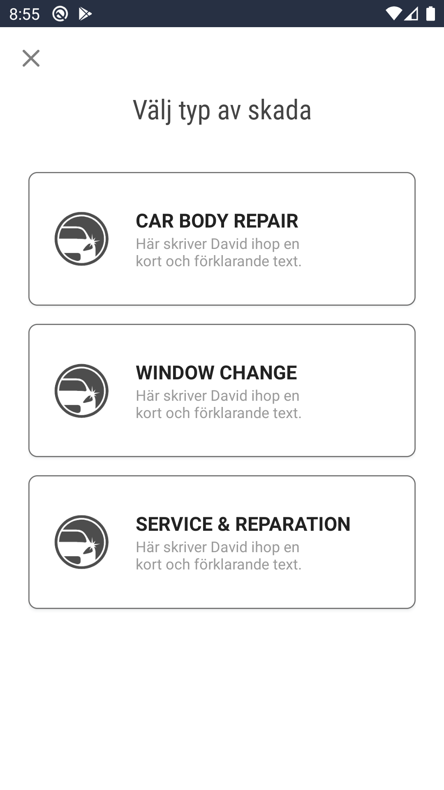
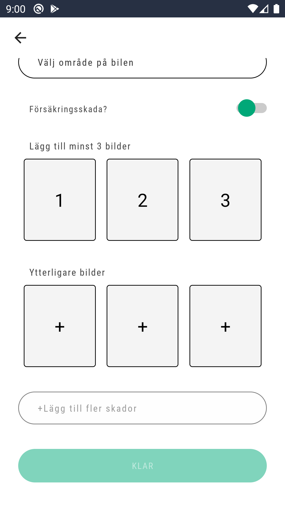
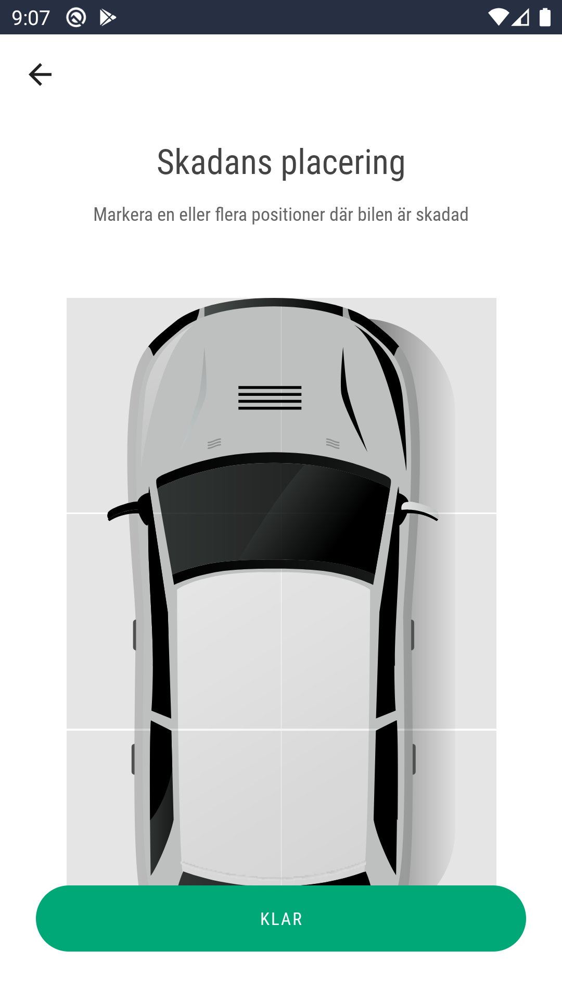

# Add Damage Screen

## Description

    1. When doing an inspection the staff member has the ability to add a new damages be it either to a completely new car (explained in CarInspectionScreen.md) or add them to an existing car, depending on the needs at hand

## Damage Type

    1. The first step is to choose the type of the damage
        - Car Body Damage
        - Window/Glass Damage
        - Service & Reparation

## Car Body Damage

<!--

 -->

    1. A Location Button that redirects to the location selection screen
    2. A switch that indicates if the damage is insurance or not
        - if the button is switched 2 new text fields appear for the information needed for the insurance
    3. 3 Empty slots for the required 3 images
    4. 3 Empty slots for any additional images if the users so decides to.
    5. Button to add the current damage and begin the process for another one of the same type
