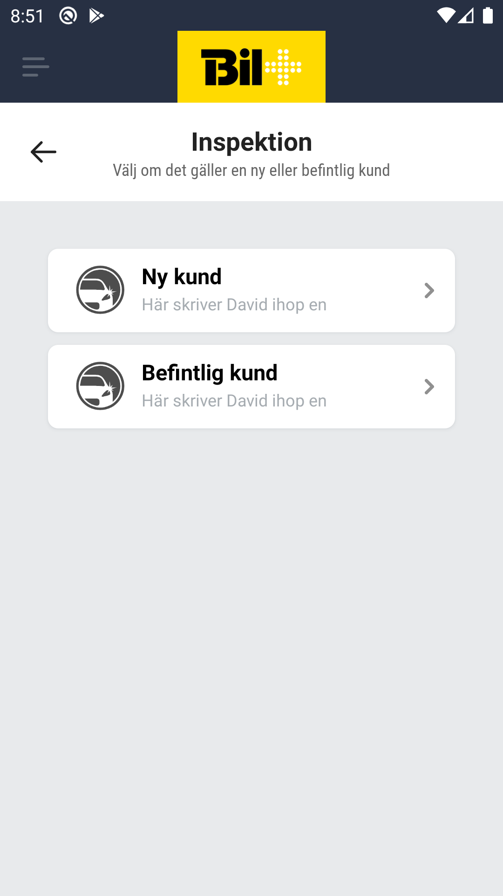
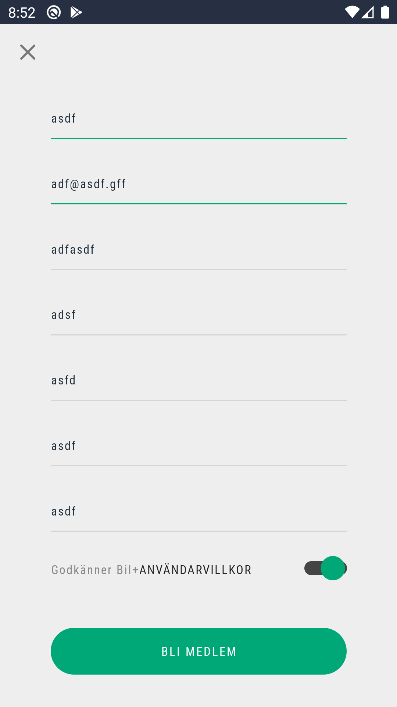

# Car Inspection Screen

## New car or existing car

    1. The staff member needs to choose if he wants to add a new car or add a damage to an already existing car.
    2. If a new car is selected, the staff member will first go through registering new customer and afterwards registering the car and then add the damages.
    3. If existing car is chosen, the staff member is  redirected to the car select screen. After he chooses the car he will be redirected to the add damage screen

