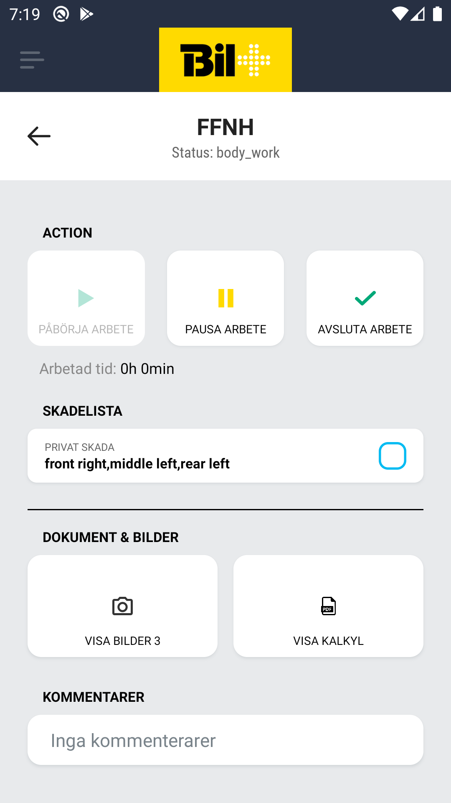

# Car Production Screen

## Description

The staff member can choose to  start, pause or stop work on the current status, write comment and add extra jobs.

## Actions

1. Start
    - Starts the work on the current status and shows a timer that tracks the time for the work. The staff member is redirect to a check list screen for a double check on the proper steps, afterwards he is redirected to a screen which allows him to take a photo of area that will be worked on
2. Pause
    - Pauses the current active work and the timer
3. Stop
    - Completes the work on the current status,by redirecting the staff member to check list screen where he can double check if everything has been completed correctly, he is then redirected to screen that allows him to take a photo of the completed job. Finally the staff member is redirected to screen where he can choose the next status. 

## Damages List

List of all the damages registered for the car.
Each item contains:
    - damage type
    - damage locations
    - checkbox

`Needs explanation to what the checkbox selection does exactly`

## Images & Documents

1. Gallery button that opens a screen with all the photos related to the car
2. Pdf button should open related document

## Comment

 1. Single text field containing comments about the car

## Extra job

 1. List of extra jobs that need to be done on the car
 2. Button to add a new item to the list
 3. The button opens up a new page with a single text field
 4. Each item can be clicked to remove it from the list
