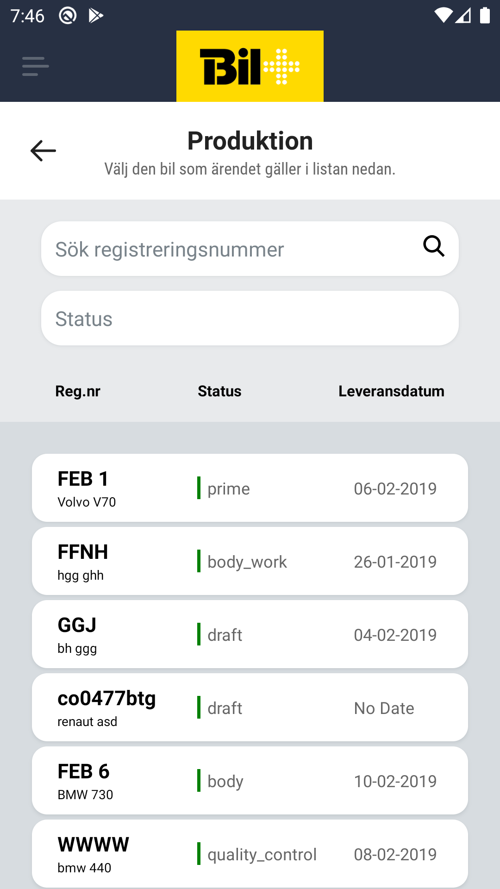

# Car Select Screen

## Description

Every step that requires a selection of a car will first go through this screen.

## Search Field

A single text field that searches car by their registration number

## Status Filter

The car can be filtered by the status they are currently in

## Results List

Infinite scroll paginated list with the results filtered by the above fields. Each item in the list contains:
    - The registration number with the car model
    - The current status of  the car
    - Delivery date (?)
