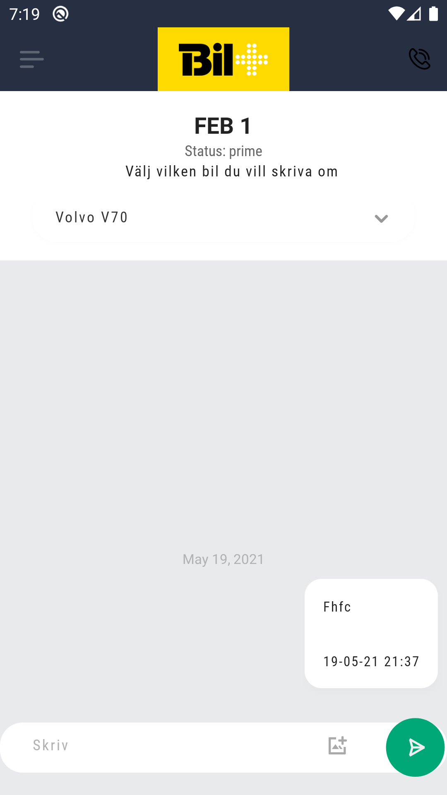
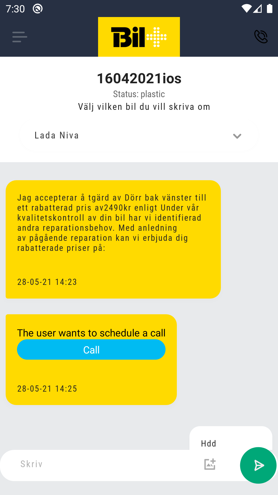
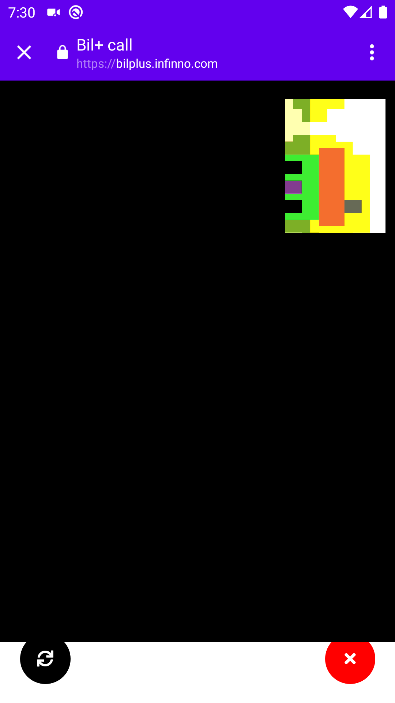

# Chat Screen

The staff member is able to keep 1 to 1 communication with the customer through a chat room made for each registered car. The 2 parties can send each other files, photos and other media. The customer is able to book a call and the staff member is able to send booking suggestions.

After going through the <a href="./CarSelectScreen.md">car select screen</a> the staff member will be presented with the chat screen and be able to choose to initiate direct conversation, send a booking suggestion or directly video call the customer

## Chat

A header displays basic info about the car, the button bellow can be pressed to be returned in the <a href="./CarSelectScreen.md">car select screen</a>
A simple chat messaging screen that displays each party's message along with the date it was sent on.

Message composer where the user can input his message and a button to send media files.

## Booking suggestion

Whenever a booking suggestion is made through the staff backend a message will be displayed in the chat which the customer can interact with

## Video Calls

The staff member can choose to video call the customer with the button in the top right corner.

