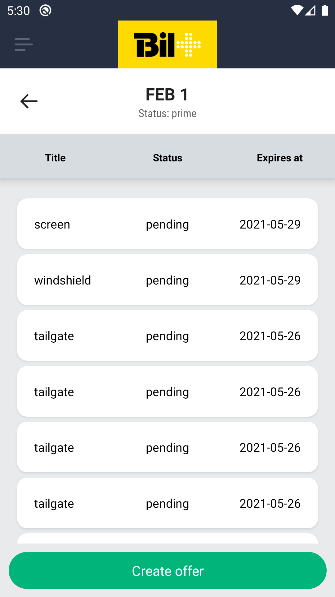
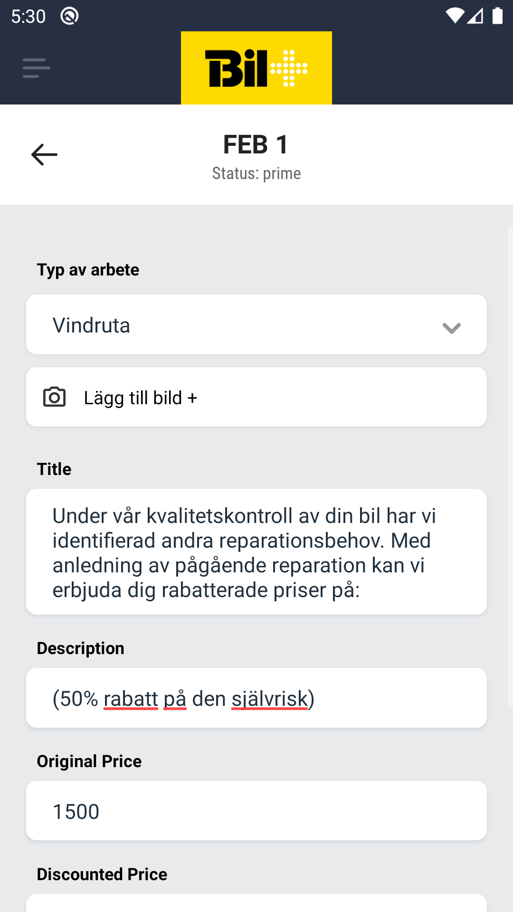
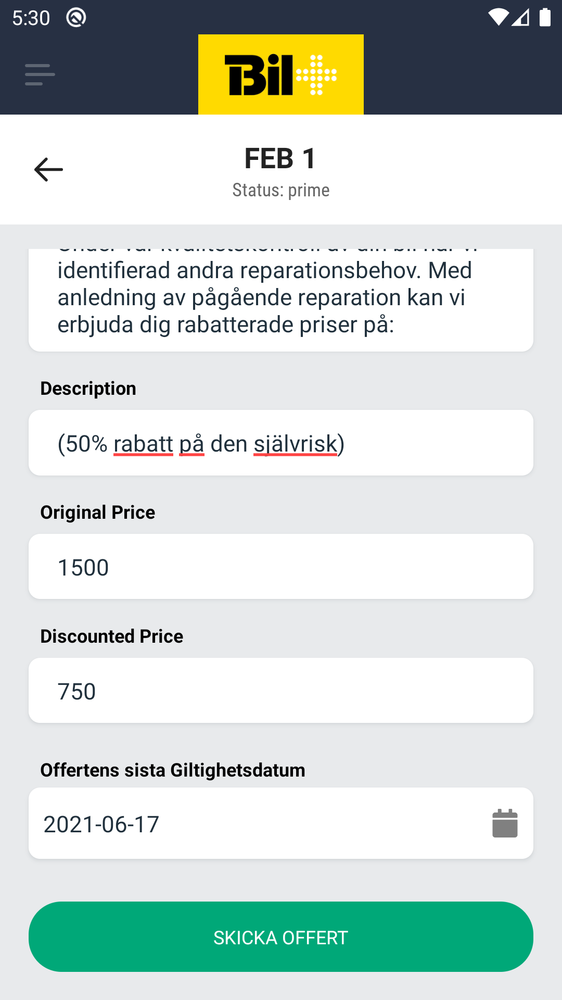
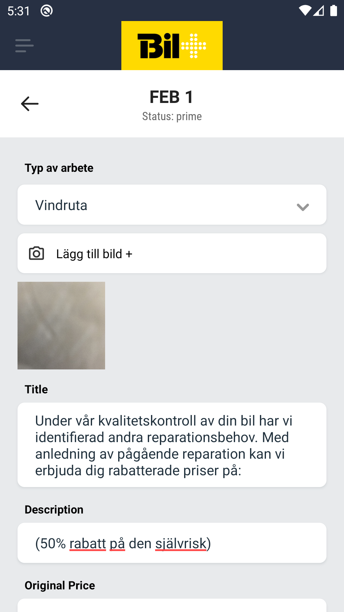

# Offers Screen

Staff member can create offers for different parts of the production process which in turn can be accepted or rejected by the customer.

## Offer List

After selecting the offers menu the staff member will be presented with the <a href="./CarSelectScreen.md">car select screen</a>. After choosing a car, a list of all the offers made for that car will show.  
Each offer in the list consists of

1. Type of the offer
2. Status of the offer `pending`, `accepted` or `rejected`
3. Expiration date

A button at the bottom of the screen redirects to the offer creation screen

    

## Creating offers

After clicking on the `create offer` button the staff member will be presented with the create offer screen which consists of:

1. Drop down list for the type of the offer

   - Vindruta
   - Stotfangare
   - Fronthuv
   - Skarm
   - Dorr
   - Baklucka
   - Tak

2. Button for taking a picture through the phone camera
3. Text field for the title of the offer
4. Text field for the description of the offer
5. Text field for the original price
6. Text field for the discounted price
7. Date field for the expiration date
8. Button to create the offer

    
    

## Editing offers

A created offer can be edited by clicking it in the offers list screen which will in turn redirect to the create offer screen but will all the fields already filled with the data from the clicked offer.

    

