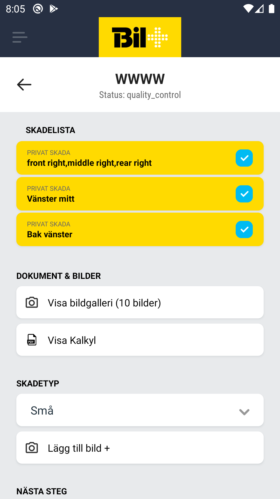
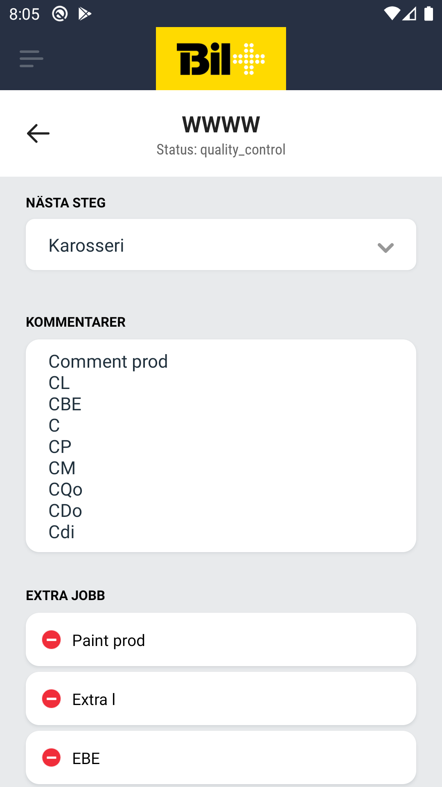

# Quality Control In Screen

## Description
  
    (?)

## Damage List

    (?)

## Documents & Photos

    1. Gallery button
    2. PDF button

## Damage amount (?)

    1. Dropdown with the options
        - small
        - medium
        - large
    2. Button to take a photo

## Next Step field (?)

    1. Dropdown with all the statuses(?)

## Comment

    1. Single text field for the car comments

## Extra jobs

    1. List with extra job items
    2. The items consist of text explaining the job
    3. Item can be added through the button on top of the list
    4. Item can be removed by clicking on the item  itself.

## Submit button

    1. Redirect to check list screen to double checked required steps
    2. Saves the data